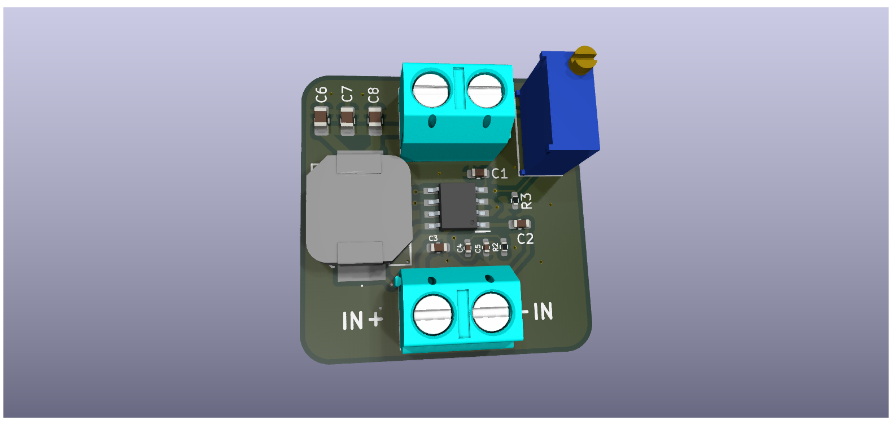

# DC to DC Buck Converter

A Simple but capable DC to DC Step down Converter range voltage Input Voltage Range: 3.8V to 40V and Output Voltage Range: 0.8V to ~19V 

## Technical Details
* **Core IC:** AP64501SP-13 Step down IC
* **Design Software:** KiCad 
* **Key Features:** A variable Step Down DC to DC Buck Converter 

## Included Files
* KiCad source files (Schematic & PCB layout)
* PDF Schematic for quick viewing
* Ready-to-manufacture Gerber files

